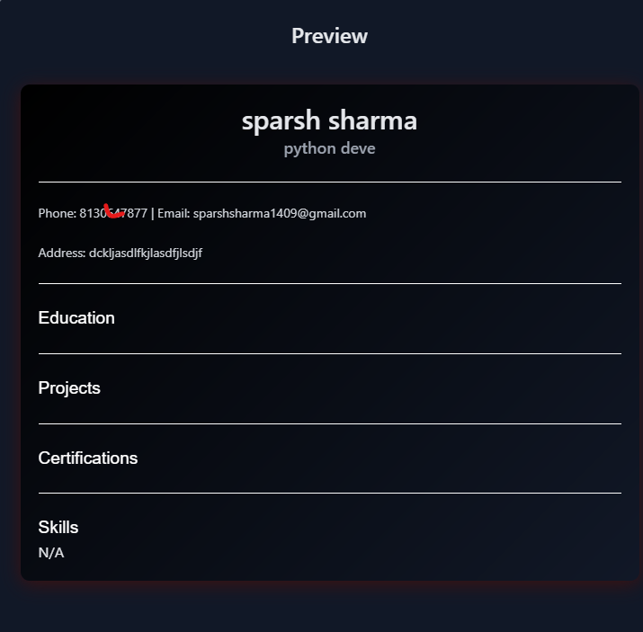

# Resume Generator  

An interactive web application for creating professional resumes effortlessly. Built using **HTML**, **CSS (Tailwind CSS)**, and **JavaScript**, this project showcases a responsive design with real-time preview functionality.  

## Features  
- **Dynamic Form:** Input sections for personal information, education, experience, certifications, skills, and projects.  
- **Real-Time Preview:** A live preview of the resume updates automatically as you fill in the details.  
- **Customizable Design:** Choose from different themes, fonts, and layouts to match your style.  
- **Responsive Layout:** Works seamlessly across desktop and mobile devices.  
- **Interactive Elements:** Hover effects, transitions, and an advanced skill input system that converts text into boxed items.  

## Demo  
  
  

## Preview Feature  
The **real-time preview** is the standout feature of this project. Every change made in the form is instantly reflected in the resume preview, demonstrating advanced **JavaScript DOM manipulation** and state handling. This feature enhances user interaction and showcases the app's dynamic nature.  

## Technologies Used  
- **HTML5**: Structure of the web application.  
- **CSS (Tailwind CSS)**: For modern, responsive, and visually appealing designs.  
- **JavaScript**: Core functionality, especially for real-time updates and transitions.  

## How to Use  
1. Clone the repository:  
   ```bash  
   git clone https://github.com/Mrshelby0/resume-generator.git  
   ```  
2. Open the project folder:  
   ```bash  
   cd resume-generator  
   ```  
3. Open `index.html` in your browser to start using the application.  

## Contributions  
Feel free to fork this repository, create a branch, and submit a pull request. All contributions are welcome!  

## License  
This project is licensed under the MIT License.  

